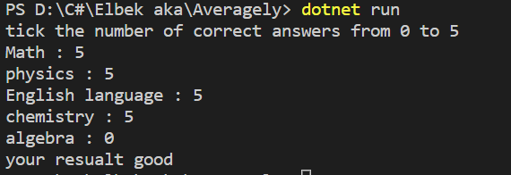

# Averagely

this project calculates exam answers

Have a look at *`Program.cs`* file and you can see hoe I have used: 

* Console input/output
* taking into account the number of points
* Arithmetic operations
* Switch operation
* Switch Expression

## Demo 

## This Switch Expression

